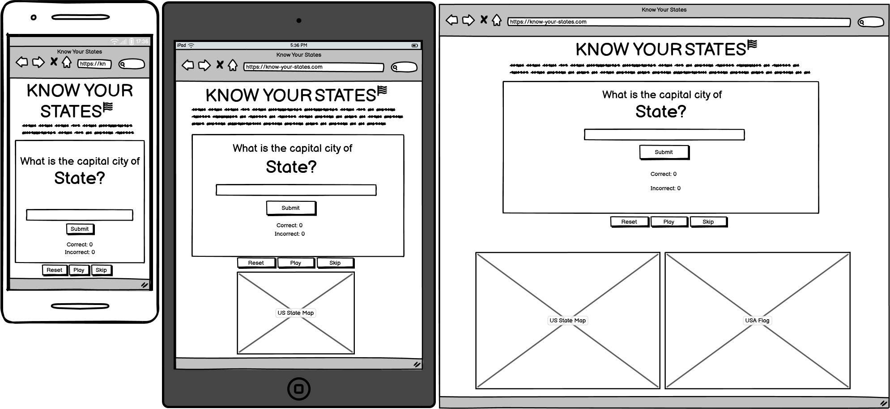

# Know Your States

Know Your States is a quiz game which asks the player to name the capital city of different US states. It's a test of knowledge and a way for players to learn when they get an incorrect answer. The game will track the players score until the game is reset. The audience for the game are people interested in geography or quizzes.

## Table of Contents

**[1. User Experience](#user-experience)**
* [1.1 Design](#design)
* [1.2 User Stories](#user-stories)

**[2. Features](#features)**
* [2.1 Existing Features](#existing-features)
* [2.2 Features Left to Implement](#features-left-to-implement)

**[3. Testing](#testing)**

**[4. Technologies](#technologies)**
* [4.1 Languages](#languages)
* [4.2 Libraries & Programs Used](#libraries--programs-used)

**[5. Deployment](#deployment)**  
* [5.1 Deploying this repository](#deploying-this-repository)
* [5.2 Cloning this repository](#cloning-this-repository)
* [5.3 Forking this repository](#forking-this-repository)

**[6. Credits](#credits)**

## User Experience

### Design

#### Typography

I have used the Open Sans font from Google Fonts due to this being widely popular and easily legible. It gives the quiz a clean look and feel.

#### Icons

I have used the USA flag icon in the title as it provides context to the title of "Know Your States", ensuring it is easily recognisable as referring to the United States of America.

#### Wireframes

### User Stories

#### First Time Visitor Goals

- To test their current knowledge on the state capital cities of the USA.
- To find the quiz easy and intuitive to use.
- To have fun playing the quiz so that there is replayability.
- To have the correct answers shown on an incorrect answer, to help learn for next time.

#### Returning Visitor Goals

- To try and beat their previous score.
- To refresh their knowledge.

## Features

### Existing Features

### Features Left To Implement

## Testing

Testing documentation can be found in the [TESTING.md](TESTING.md) file.

## Technologies

### Languages

HTML, CSS & Javascript

### Libraries & Programs Used

- Balsamiq - Used to create wireframes.
- Git - Used for version control.
- Github - Used to save site files.
- Google Fonts - Used to import fonts.
- Font Awesome - Used to import icons.
- Chrome Developer Tools - Used to test site responsiveness and design features.

## Deployment

### Deploying This Repository

This repository is deployed using GitPages. The following steps must be taken:  
1. Locate the github repository on GitHub. [Here](https://github.com/JCook22/know-your-states)  
2. Find settings from the options at the top of the screen.  
3. Navigate down to the Pages section.  
4. From the source drop-down box select Deploy from a branch and from the branches select Main and save.
5. The page should be live and you can click on Visit site.

### Cloning This Repository

To clone this repository. The following steps must be taken:
1. Locate the github repository on GitHub. [Here](https://github.com/JCook22/know-your-states)  
2. Click on the green Code button and select whether you want to clone it with HTTPS, SSH or GitHub CLI. Copy the URL provided.  
3. Open a terminal in your preferred code editor and select a new location for the cloned directory.
4. Type "git clone" in the terminal, followed by the link you copied in step 2 and press Enter.

### Forking This Repository

To fork this repository. The following steps must be taken:
1. Locate the github repository on GitHub. [Here](https://github.com/JCook22/know-your-states)  
2. Click on the Fork button above the About section.

## Credits

### Content

- I learned how to shuffle the array so that the questions appear in a random order using this thread on [Stackoverflow](https://stackoverflow.com/questions/2450954/how-to-randomize-shuffle-a-javascript-array).

### Media

- The US state map picture shown on devices 600px width and above was created using [Mapchart](https://www.mapchart.net/usa.html).

- The USA flag picture shown on devices 1200px width and above was downloaded from [Pixabay](https://pixabay.com/vectors/american-flag-usa-flag-symbol-2144392/).