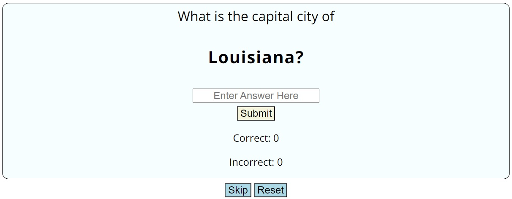
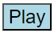
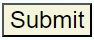
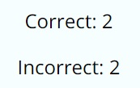
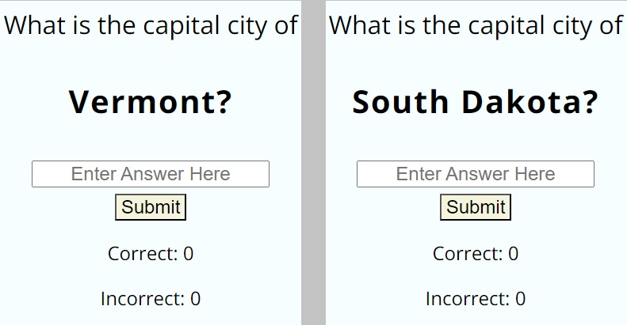

# Know Your States

Know Your States is a quiz game which asks the player to name the capital city of different US states. It's a test of knowledge and a way for players to learn when they get an incorrect answer. The game will track the players score until the game is reset. The audience for the game are people interested in geography or quizzes.

## Table of Contents

**[1. User Experience](#user-experience)**
* [1.1 Design](#design)
* [1.2 User Stories](#user-stories)

**[2. Features](#features)**

**[3. Testing](#testing)**

**[4. Technologies](#technologies)**
* [4.1 Languages](#languages)
* [4.2 Libraries & Programs Used](#libraries--programs-used)

**[5. Deployment](#deployment)**  
* [5.1 Deploying this repository](#deploying-this-repository)
* [5.2 Cloning this repository](#cloning-this-repository)
* [5.3 Forking this repository](#forking-this-repository)

**[6. Credits](#credits)**

## User Experience

### Design

#### Typography

I have used the Open Sans font from Google Fonts due to this being widely popular and easily legible. It gives the quiz a clean look and feel.

#### Icons

I have used the USA flag icon in the title as it provides context to the title of "Know Your States", ensuring it is easily recognisable as referring to the United States of America.

#### Wireframes

### User Stories

#### First Time Visitor Goals

- To test their current knowledge on the state capital cities of the USA.
- To find the quiz easy and intuitive to use.
- To have fun playing the quiz so that there is replayability.
- To have the correct answers shown on an incorrect answer, to help learn for next time.

#### Returning Visitor Goals

- To try and beat their previous score.
- To refresh their knowledge.

## Features

### Existing Features

#### Title 

The title for the website is designed using the colours of the american flag; red, white and blue. The USA flag icon was also added to provide context to the title. This helps the user to get an idea of what the topic of the quiz is at a glance.

#### Introduction

The introduction message gives a brief overview so that new users know what to expect when playing the quiz for the first time. 

#### Quiz area

The quiz area is the most important area of the site. This is where all the interactive elements are found and change as the user takes the quiz.

#### Question area

Before the quiz has begun there will be the placeholder text of "What is the capital city of...?". When the quiz is started the rest of the question appears with the state in bold so it stands out to the user. The question is updated any time the user submits an answer, skips a question or resets the quiz.

#### Answer box

The answer box is where the user will input their answers to the questions. The placeholder text reads "Enter Answer Here" to make it clear what it is for and input is not case sensitive to make it more user friendly. The input field cannot be left blank when submitting an answer and a alert will pop up if you try.

#### Play button

The play button is found at the bottom of the quiz area. When the user clicks on it for the first time it begins the quiz and disappears and is replaced with the skip and reset buttons.

#### Submit button

The submit button is found just below the answer box once the quiz is running. It should be clear to the user that they must use the submit button once they have typed their answer. Multiple things happen when an answer is submitted, the user is alerted if they got it correct or not, their score tallys are updated and the next question is displayed.

#### Alert box

The alert box appears for a variety of different reasons when interacting with the quiz. It alerts users when they submit a correct or incorrect answer. If the user tries to submit an answer without filling in the input box it will appear to warn them it cannot be blank. When an incorrect answer is supplied or a question is skipped then the alert will also contain what the correct answer would've been.

#### Score counter

The score counter provides an easy way for the user to track their progress and compare with others. It also makes the user more likely to want to replay the quiz and see if they can improve their score.

#### Skip button

The skip button is found at the bottom of the quiz area once the quiz is running. Clicking the skip button will alert the user and provide them with what the correct answer would've been. The next question will appear and the users incorrect score will increase by 1.

#### Reset button

The reset button is found at the bottom of the quiz area once the quiz is running. Clicking the reset button will change the users scores to 0 and allow them to start again from a random question.

#### Randomised order

The quiz will always appear in a random order. If a user clicks the reset button during the quiz then the questions will be shuffled again, meaning someone is very unlikely to ever answer the questions in the same order twice.

#### State map

The state map image is located underneath the quiz area on tablets and other larger screen sizes. It is helpful to the user as it can be useful in helping to jog their memory. It also fits well with the theme of the quiz.

#### USA flag

The USA flag image is located underneath the quiz area on larger screen sizes such as laptops and desktops. It is purely decorative but provides more colour and fits well with the theme of the quiz.

## Testing

Testing documentation can be found in the [TESTING.md](TESTING.md) file.

## Technologies

### Languages

HTML, CSS & Javascript

### Libraries & Programs Used

- Balsamiq - Used to create wireframes.
- Git - Used for version control.
- Github - Used to save site files.
- Google Fonts - Used to import fonts.
- Font Awesome - Used to import icons.
- Chrome Developer Tools - Used to test site responsiveness and design features.

## Deployment

### Deploying This Repository

This repository is deployed using GitPages. The following steps must be taken:  
1. Locate the github repository on GitHub. [Here](https://github.com/JCook22/know-your-states)  
2. Find settings from the options at the top of the screen.  
3. Navigate down to the Pages section.  
4. From the source drop-down box select Deploy from a branch and from the branches select Main and save.
5. The page should be live and you can click on Visit site.

### Cloning This Repository

To clone this repository. The following steps must be taken:
1. Locate the github repository on GitHub. [Here](https://github.com/JCook22/know-your-states)  
2. Click on the green Code button and select whether you want to clone it with HTTPS, SSH or GitHub CLI. Copy the URL provided.  
3. Open a terminal in your preferred code editor and select a new location for the cloned directory.
4. Type "git clone" in the terminal, followed by the link you copied in step 2 and press Enter.

### Forking This Repository

To fork this repository. The following steps must be taken:
1. Locate the github repository on GitHub. [Here](https://github.com/JCook22/know-your-states)  
2. Click on the Fork button above the About section.

## Credits

### Content

- I learned how to shuffle the array so that the questions appear in a random order using this thread on [Stackoverflow](https://stackoverflow.com/questions/2450954/how-to-randomize-shuffle-a-javascript-array).

### Media

- The US state map picture shown on devices 600px width and above was created using [Mapchart](https://www.mapchart.net/usa.html).

- The USA flag picture shown on devices 1200px width and above was downloaded from [Pixabay](https://pixabay.com/vectors/american-flag-usa-flag-symbol-2144392/).