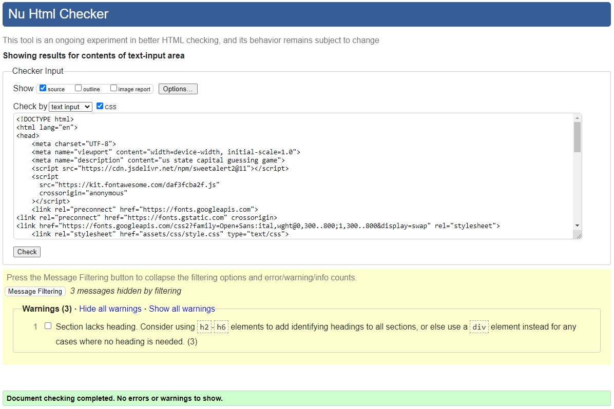
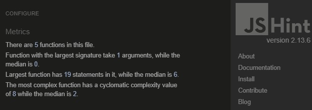
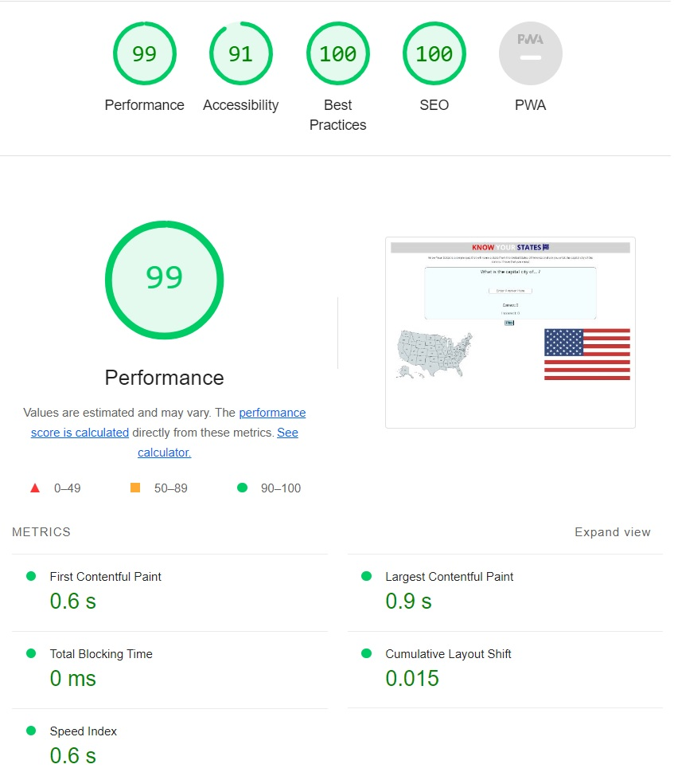
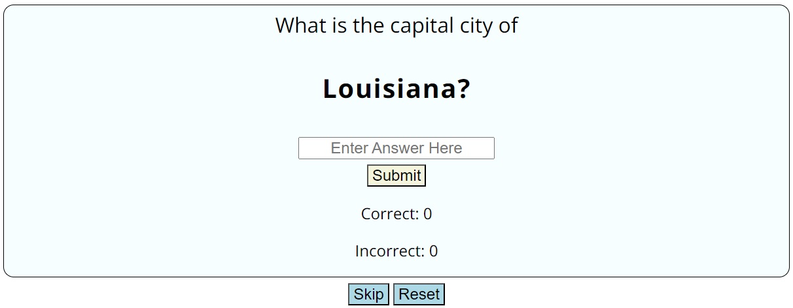
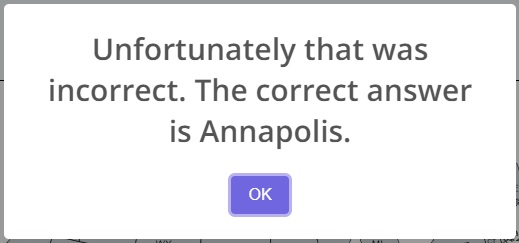
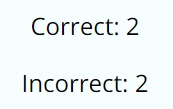
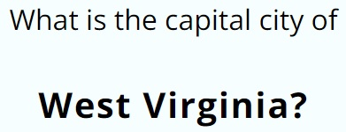
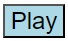
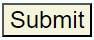

# Know Your States - Testing

## Validator Testing

The W3C validator was used to check all the HTML and CSS for the site. JSHint was used to check the Javascript.

### HTML

Aside from sections not having headings - which can be ignored - the HTML passed validation.

### CSS

No issues were found in the CSS.

### JS

JS Hint found no issues with the code.

## Lighthouse Testing 

### Mobile

### Desktop

## Manual Testing

### User Stories

#### First Time Visitor Goals

1. To test their current knowledge on the state capital cities of the USA.
    - The quiz area provides all the interactivity required, all 50 state capitals are included.

2. To find the quiz easy and intuitive to use.
    - The quiz layout is very simple and is designed so that first time users should be able to understand how it works at a glance.

3. To keep track of their score so they know how well they are doing.
    - The score counters provided allow a user to see how well they are doing before they finish the quiz.

4. To be able to reset the quiz if they want to try again.
    - The reset button is easy to find at the bottom of the quiz, so the user can reset whenever they like.

    

5. To have the correct answers shown on an incorrect answer, to help learn for next time.
    - Should the user supply an incorrect answer or skip a question they will be alerted of what the answer should have been.

     

#### Returning Visitor Goals

1. To try and beat their previous score.
    - Thanks to the score counter the user can attempt to beat their previous score. Unfortunately at this time there is no way to save your results to compare with.
    
    

2. To refresh their knowledge.
    - The quiz can be taken as many times as the user likes so it is helpful if they wish to improve or refresh their knowledge.

3. To answer the questions in a random order so it's better to revisit.
    - The quiz is always shuffled before it begins or when it is reset. This ensures that repeat users will still find it interesting and a challenge.

    

### Feature Testing

#### Question Area

- Expected - The state in bold should change each time a new question is started.
- Testing - Will submit an answer to the question and see if the state changes.
- Result - The state changed and the new question appeared.

#### Randomised Order

- Expected - When resetting the quiz the order of the questions should change.
- Testing - Will reset the quiz and check that the question changes.
- Result - The quiz reset and started again from a different question.

#### Score Counter

- Expected - When the user answers a question correctly or incorrectly it will add to the score counter.
- Testing - Will answer 2 questions correctly and incorrecty.
- Result - The scores updated to show the new score of 2 correct answers and 2 incorrect answers.

#### Play Button

- Expected - When the user clicks play, the button will disappear and the quiz will begin. This will make the submit, reset and skip buttons all appear. The question will also appear in full.
- Testing - Will click play and ensure everything changes as expected.
- Result - The question appeared in full and the skip, reset and submit buttons all appeared.

#### Submit Button

#### Skip Button

#### Reset Button

