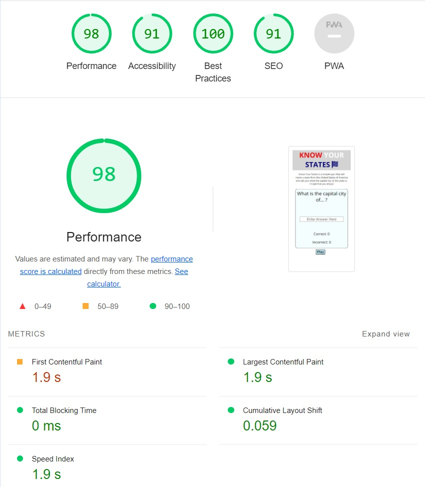

# Know Your States - Testing

## Validator Testing

The W3C validator was used to check all the HTML and CSS for the site.

### HTML

### CSS

### JS

## Lighthouse Testing 

### Mobile

### Desktop

## Manual Testing

### User Stories

#### First Time Visitor Goals

#### Returning Visitor Goals

### Feature Testing

#### Question Area

#### Randomised Order

#### Score Counter

#### Play Button

#### Submit Button

#### Skip Button

#### Reset Button

