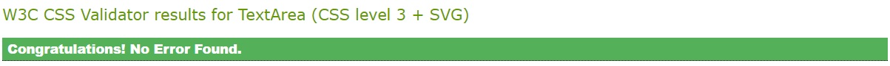

# Know Your States - Testing

## Validator Testing

The W3C validator was used to check all the HTML and CSS for the site. JSHint was used to check the Javascript.

### HTML

Aside from sections not having headings - which can be ignored - the HTML passed validation.

### CSS

No issues were found in the CSS.

### JS

JS Hint found no issues with the code.

## Lighthouse Testing 

### Mobile

### Desktop

## Manual Testing

### User Stories

#### First Time Visitor Goals

1. To test their current knowledge on the state capital cities of the USA.
    - The quiz area provides all the interactivity required, all 50 state capitals are included.

2. To find the quiz easy and intuitive to use.
    - The quiz layout is very simple and is designed so that first time users should be able to

3. To keep track of their score so they know how well they are doing.
    - The score counters provided allow a user to see how well they are doing before they finish the quiz.

4. To be able to reset the quiz if they want to try again.
    - The reset button is easy to find at the bottom of the quiz, so the user can reset whenever they like.

5. To have the correct answers shown on an incorrect answer, to help learn for next time.
    - Should the user supply an incorrect answer or skip a question they will be alerted of what the answer should have been.

 

#### Returning Visitor Goals

### Feature Testing

#### Question Area

#### Randomised Order

#### Score Counter

#### Play Button

#### Submit Button

#### Skip Button

#### Reset Button

